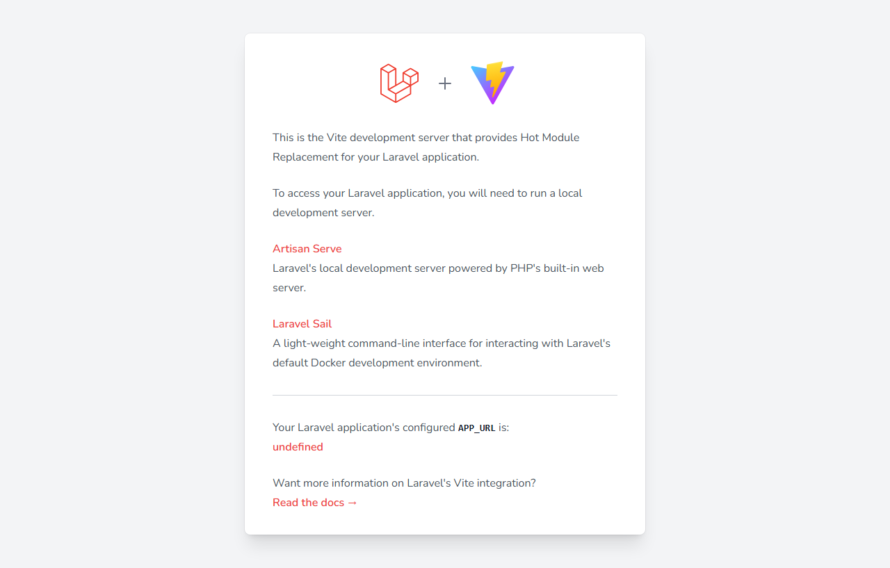

# Cloud Foundations Dashboard

Aplicación web desarrollada con React + TypeScript para representar un panel de control de infraestructura Cloud, costos, seguridad, redes y servicios AWS en una sola experiencia visual.

## Descripción general

El proyecto resuelve el problema de presentar una solución Cloud de forma clara y ejecutiva, sin depender de un backend real ni de integraciones con AWS. La aplicación está diseñada para que un usuario pueda:

- comprender el estado general de una infraestructura Cloud,
- planificar una solución con servicios AWS,
- estimar costos de forma local,
- analizar regiones, seguridad y arquitectura de red,
- navegar un catálogo de servicios con enfoque educativo y de presentación.

## Problema

Muchas soluciones Cloud se describen solo con diagramas técnicos o con texto, lo que dificulta la comprensión rápida de:

- dónde se despliega la solución,
- cómo se escala,
- qué servicios se utilizan,
- cuánto costaría,
- qué nivel de seguridad y disponibilidad se requiere.

## Solución

Cloud Foundations Dashboard ofrece un centro de control visual donde cada módulo representa una dimensión crítica de una arquitectura Cloud. En lugar de una pantalla aislada, la app organiza la información en módulos coherentes para facilitar decisiones de diseño, planificación y comunicación técnica.

## Arquitectura de la aplicación

La aplicación sigue una estructura modular basada en páginas y datos locales:

- `src/pages/`: cada módulo principal de la app (dashboard, costos, infraestructura, seguridad, red, servicios, planificación).
- `src/components/`: componentes reutilizables de UI, gráficos, cards y navegación.
- `src/data/`: datasets mock para regiones, seguridad, costos, servicios, red y planificación.
- `src/utils/`: utilidades como formato monetario y helpers de clases.
- `src/App.tsx`: enrutamiento principal con React Router.

## Conceptos Cloud representados

- Regiones y disponibilidad global.
- VPC, redes privadas y flujo de tráfico.
- EC2, RDS y servicios de apoyo a la aplicación.
- Route 53 y CloudFront como capa de entrega y acceso.
- IAM y responsabilidad compartida con AWS.
- Costos estimados por servicio y nivel de uso.

## Decisiones de diseño

- Diseño centrado en dashboards ejecutivos con jerarquía visual clara.
- Uso de un color system consistente para diferenciar costos, seguridad, infraestructura y servicio.
- Datos locales simulados para mantener la demo sin dependencias externas.
- Responsive design para escritorio, tablet y móvil con sidebar adaptable.
- Enfoque pedagógico: cada componente comunica un concepto de Cloud en contexto.

## Tecnologías

- React 19
- TypeScript
- Vite
- Tailwind CSS
- React Router
- Lucide React
- Recharts

## Requisitos

- Node.js 18+
- npm

## Instalación y ejecución local

```bash
npm install
npm run dev -- --host 0.0.0.0 --port 5174
```

Abrir la aplicación en:

http://localhost:5174/

También puedes compilar para producción con:

```bash
npm run build
npm run preview -- --host 0.0.0.0 --port 4173
```

## Funcionalidades principales

- Dashboard general de infraestructura Cloud.
- Planificación de soluciones con validación local de formulario.
- Estimación de costos por servicio y cálculo mensual/anual.
- Visualización de infraestructura por región.
- Evaluación de seguridad e IAM.
- Arquitectura de red con flujo de tráfico.
- Catálogo de servicios AWS con filtro por categoría.
- Diseño responsivo y navegación adaptativa.

## Módulos y rutas

| Ruta | Módulo |
| --- | --- |
| `/dashboard` | Panel principal |
| `/planning` | Planificación Cloud |
| `/costs` | Costos y economía Cloud |
| `/infrastructure` | Infraestructura global |
| `/security` | Seguridad e IAM |
| `/network` | Arquitectura de red |
| `/services` | Catálogo de Servicios AWS |

## Evidencias del proyecto

### Dashboard



### Planificación Cloud


### Costos y economía Cloud


### Infraestructura global


### Seguridad e IAM


### Arquitectura de red


### Servicios AWS


## Vista responsive

La aplicación mantiene una experiencia adaptada para pantallas pequeñas mediante sidebar tipo drawer, layouts apilados y contenido desplazable. Esta estrategia permite una navegación clara en móvil y tablet sin perder la identidad visual del dashboard.

## Demostración breve

La idea principal de esta solución es transformar la complejidad técnica de una infraestructura Cloud en una vista ejecutiva y comprensible. En lugar de depender de una mezcla de Excel, diagramas aislados y documentación dispersa, la app centraliza el análisis en una sola interfaz orientada a decisiones.

El producto combina tres capas principales:

1. Visión operativa: dashboard con métricas clave.
2. Diseño arquitectónico: infraestructura, red y servicios.
3. Planeación financiera y de seguridad: costos, IAM y responsabilidades.

Esto ayuda a comunicar de forma más efectiva cómo una solución Cloud puede estar organizada, protegida y dimensionada antes de pasar a una fase de implementación real.

## Estructura del proyecto

```text
cloud-foundations/
├── src/
│   ├── components/
│   ├── data/
│   ├── pages/
│   ├── utils/
│   ├── App.tsx
│   ├── index.css
│   └── main.tsx
├── docs/
│   └── screenshots/
├── package.json
├── vite.config.ts
├── tailwind.config.js
├── tsconfig.json
├── README.md
└── index.html
```

## Conclusión

El proyecto presenta una interfaz profesional con un diseño consistente, un uso correcto de colores y una buena jerarquía visual que facilita la comprensión de la información. El espaciado uniforme, la tipografía legible y la iconografía coherente contribuyen a una experiencia visual clara y elegante, mientras que las cards están correctamente alineadas y organizadas para presentar cada sección de forma ordenada. Además, la aplicación mantiene una estructura responsiva que se adapta adecuadamente a distintos tamaños de pantalla, garantizando una experiencia funcional en escritorio, tablet y móvil.

Los formularios están bien organizados y la navegación es intuitiva, lo que mejora la usabilidad del sistema y facilita la interacción del usuario con cada módulo. En conjunto, la solución cumple con los estándares de una interfaz moderna y profesional, demostrando atención al detalle en diseño, organización visual y experiencia de usuario.

## Nota

Todos los datos mostrados son simulados y orientados a una práctica de diseño Cloud. No representan precios reales de AWS ni integración con servicios en vivo.
